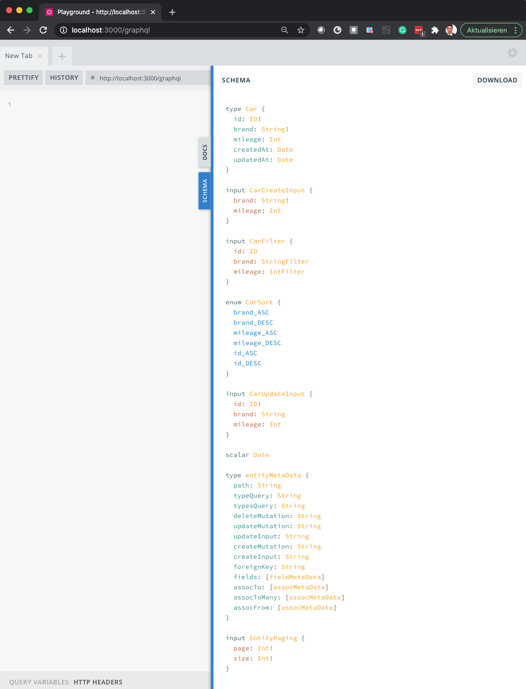
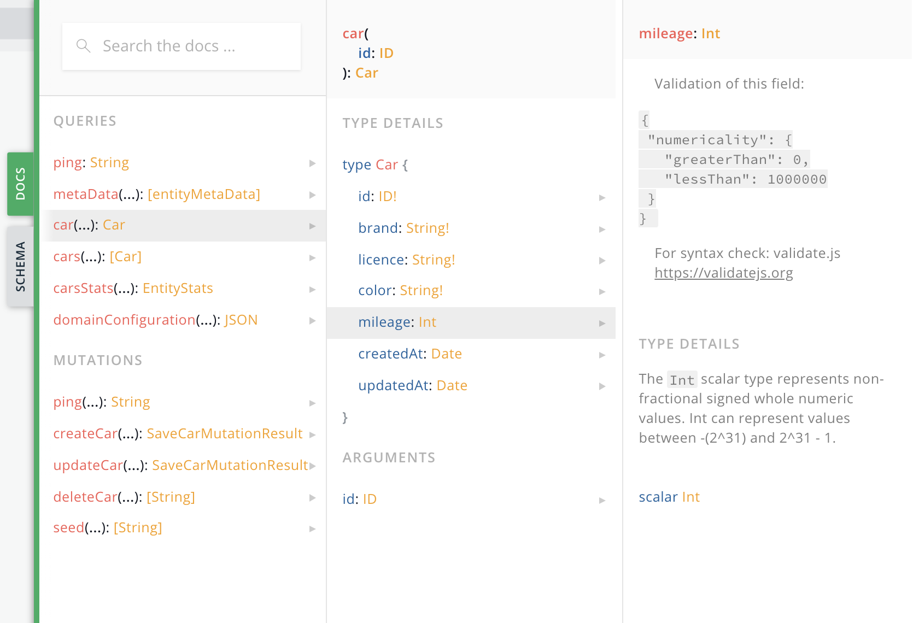

# Tutorial

### The taks
Let's assume you are assigned with the task to develop a system for managing a vehicle fleet.  It should be able to manage the cars in the fleet, known drivers, allow to read, create, update and delete those things and assign cars to drivers or vice versa.

The users of the vehicle fleet application will probably get a mobile application, or should be able to use it through their corporate intranet or in another way that ist still to be determined.

### API 1st

Given the requirements you decide to follow an API 1st approach - meaning you want expose all data and functionality through an API.  You are aware that you don't know yet what clients or 3rd party systems would want to use this API, so [GraphQL](https://graphql.org) seems  like a great choice. Based on this API you would allow to connect any customer UI. You also want to build an Admin UI application based on the same API to give access to the data and functionality to an admin or manager.

A great task for GAMA!

Analyzing the business domain teaches your, you have two entities: _Car_ and _Driver_. So you start by simply describing the first entity _Car_ with some basic attributes you might think are helpful. You enter this configuration in a YAML file called `car.yaml` and put it in the `./domain-configuration` folder of your GAMA application.

<div style="text-align: right">./tutorial/01/car.yml</div>

```yaml
entity: 
  Car: 
    attributes: 
      brand: String
      licence: String
      color: String
      mileage: Int
```

You start your express application 

```
$ npm run start

      🚀 GraphQL is now running on http://localhost:3000/graphql
      Uploads in /Projects/gama.d/gama/express/uploads
```

You start your browser and point it to the GraphQL playground at `http://localhost:3000/graphql` and check the generated schema.



You see a full GraphQL schema generated from this few lines of code; we will cover everything in detail later.   So far you want to check if everything works. 

## Simple Mutations

You see from the schema documentation that a mutation `createCar` exists; it takes the car attributes as input and returns the newly created car.

<table width="100%" style="font-size: 0.9em">
<tr valign="top">
<td width="50%"> Request </td> <td width="50%"> Response </td>
</tr>
<tr valign="top"><td>

```graphql
mutation {
  createCar ( 
    car: { 
      licence: "HH-TR 2020"
      brand: "Mercedes"
      color: "red"
      mileage: 10000 
    } 
  ) { 
    car{ id licence brand color mileage } 
  }
}
```

</td><td>

```json
{
  "data": {
    "createCar": {
      "car": {
        "id": "5fae6d009c154b3c54342c2b",
        "licence": "HH-TR 2020",
        "brand": "Mercedes",
        "color": "red",
        "mileage": 10000
      }
    }
  }
}
```

</td></tr>
</table>

Great! It actually created a car item. It was assigned an `id` by the _datastore_ that we can use later when  handling this car item. The datastore is by default a local MongoDB instance - which you can change to use other databases, like Mysql or even another API, like REST. For now we stick with the default implementation. 

Let's see if we can update the 'color' attribute value to "blue". We learn from  the schema that the input to the `updateCar` mutation expects the `id`. We copy and paste this from the previously created car result.

<table width="100%" style="font-size: 0.9em">
<tr valign="top">
<td width="50%"> Request </td> <td width="50%"> Response </td>
</tr>
<tr valign="top"><td>


```graphql
mutation {
  updateCar ( 
    car: { 
      id: "5fae6d009c154b3c54342c2b"
      color: "blue", 
    } 
  ) { 
    car{ id licence brand color mileage } 
  }
}
```

</td><td>

```json
{
  "data": {
    "updateCar": {
      "car": {
        "id": "5fae6d009c154b3c54342c2b",
        "licence": "HH-TR 2020",
        "brand": "Mercedes",
        "color": "blue",
        "mileage": 10000
      }
    }
  }
}
```

</td></tr>
</table>

You probably notice that we only provided the attribute we wanted to change, "color"; the rest the of the item is obviously kept untouched as we see in the car result from the mutation.

## Validations

You also may realize the schema does not ensure any of the attribute values being always provided - so you could create an car without providing licence or registration number. 

You express this business requirement - a car must have a licence number, brand and a color (let's assume the mileage is optional for now) by adding a trailing `!` to the mandatory attributes (which in fact is a just a shortcut notation): 

<div style="text-align: right">./tutorial/02/car.yml</div>

```yaml
entity:
  Car:
    attributes:
      brand: String!
      licence: String!
      color: String!
      mileage: Int
```


<table width="100%" style="font-size: 0.9em">
<tr valign="top">
<td width="50%"> Request </td> <td width="50%"> Response </td>
</tr>
<tr valign="top"><td>

Let's create a 2nd car and if we leave out the 'licence` again ...

```graphql
mutation {
  createCar ( 
    car: { 
      brand: "BMW",       
      color: "white"
      mileage: 10000 
    } 
  ) { 
    car{ id licence brand color mileage } 
  }
}
```

</td><td>

... we get an expected error from our GraphQL API.

```json
{
  "error": {
    "errors": [
      {
        "message": "Field \"CarCreateInput.licence\" of required type \"String!\" was not provided.",
      }
    ]
  }
}
```

</td></tr>
<tr valign="top"><td>

Now we add all required attributes ...

```graphql
mutation {
  createCar ( 
    car: { 
      licence: "HH-BO 2020"
      brand: "BMW",       
      color: "white"
      mileage: 10000 
    } 
  ) { 
    car{ id licence brand color mileage } 
  }
}
```

</td><td>

... and the car is created.

```json
{
  "data": {
    "createCar": {
      "car": {
        "id": "5fae769c699673446f2256fc",
        "licence": "HH-BO 2020",
        "brand": "BMW",
        "color": "white",
        "mileage": 10000
      }
    }
  }
}
```

</td></tr>
</table>

So far we ensured our API handles expected or mandatory values correctly. But what about the "mileage" attribute? Obviously it wouldnt make sense to allow negative or very high values here. We should inform a client in out API documentation about it and also validate any input to match these requirements. We can add this to the "mileage" attribute definition.

<div style="text-align: right">./tutorial/03/car.yml</div>

```yaml
entity:
  Car:
    attributes:
      brand: String!
      licence: String!
      color: String!
      mileage:
        type: Int
        validation:
          numericality:
            greaterThan: 0
            lessThan: 1000000
```

Since we now add more information to the attribute's configuration we can no longer use the type shortcut notation and have to write the full [Attribute Configuration](./attribute-configuration.md) for the "mileage".

The default EntityValidation uses [ValidateJS](https://validatejs.org) for expressing attribute validation logic. Any requirement you cannot express by that can be added programmatically - which we would cover later. 

Adding this to the attribute has a twofold effect - any validation is executed before the `create` or `update` mutations; the data are only written to the _datastore_ when all validation passes. And the validation configuration is added to the documenatation of your schema; and is also available as metdata - so any client of your API is informed about expected validations and could even use the configuration (assuming ValidateJS is available) in client-side validation.




<table width="100%" style="font-size: 0.9em">
<tr valign="top">
<td width="50%"> Request </td> <td width="50%"> Response </td>
</tr>
<tr valign="top"><td>


```graphql
query {
  metaData( path: "cars" ){
    fields { name validation }
  }
}
```

</td><td>

```json
{
  "data": {
    "metaData": [
      {
        "fields": [
          {
            "name": "mileage",
            "validation": {
              "numericality": {
                "greaterThan": 0,
                "lessThan": 1000000
              }
            }
          }
        ]
      }
    ]
  }
}
```

</td></tr>
</table>

While we're at it let's look at the `licence` attribute. We declared it as `required` which makes sense, but a client could create two cars with the same value, which would not make sense and could have unwanted effects. So we want to define this attribute as `unique`. 

<div style="text-align: right">./tutorial/04/car.yml</div>

```yaml
entity:
  Car:
    attributes:
      brand: String!
      licence: 
        type: String
        required: true
        unique: true
      color: String!
      mileage:
        type: Int
        validation:
          numericality:
            greaterThan: 0
            lessThan: 1000000
```

You may now see that `String!` was in fact a shortcut notation for ` { type: 'String', required: true } ` which we write now. Having an  attribute as a kind of an identifier; thus being of type `String`, `required` and `unique` is quite common - therefore GAMA offers a shortcut notation for this as `type Key`. So we could have written the attribute also as `licence: Key`. 

Be aware these kind of validations (greater, less, unique etc) other than `required` can not be enforced by the GraphQL layer; instead it's handled by GAMA. To inform an API client about an invalid mutation call no error is thrown, but a list of so called `ValidationViolation` is returned. Clients should add this to their mutations to get any validation error. 

<table width="100%" style="font-size: 0.9em">
<tr valign="top">
<td width="50%"> Request </td> <td width="50%"> Response </td>
</tr>
<tr valign="top"><td>


```graphql
mutation {
  createCar ( 
    car: { 
      licence: "HH-BO 2020"
      brand: "BMW",       
      color: "white"
      mileage: -100
    } 
  ) { 
    car{ id licence brand color mileage } 
    validationViolations { attribute message }
  }
}
```

</td><td>

```json
{
  "data": {
    "createCar": {
      "car": null,
      "validationViolations": [
        {
          "attribute": "licence",
          "message": "value 'HH-BO 2020' must be unique"
        },
        {
          "attribute": "mileage",
          "message": "Mileage must be greater than 0"
        }
      ]
    }
  }
}
```

</td></tr>
</table>

See how we added the `validationValidations` to the return of the mutation thus getting the info about the validation errors.

To check the final mutation we want to delete the last created car. This works as expected. 

<table width="100%" style="font-size: 0.9em">
<tr valign="top"><td width="50%"> Request </td> <td width="50%"> Response </td></tr>
<tr valign="top"><td>


```graphql
mutation {
	deleteCar( id: "5fae769c699673446f2256fc" )
}
```

</td><td>

```json
{
  "data": {
    "deleteCar": []
  }
}
```

</td></tr>
</table>

## Seed data

Creating, updating and deleting of cars obviously works nicely. But before we continue adding new functionality it would be great to have reliable test or example data to play around. Having to add cars, and later drivers etc. via API call or even a UI would be tedious. So let GAMA handle this and seeding data into our application. 

A nice effect would also that we do not have to clean up entity items in the _datastore_ that no longer fit to our current configuration, like if we had with cars created with unwanted data before we added validations to the configuration.

So let's add so-called _seed data_ to the existing configuration file; later we would probably seperate this, since we don't want that in production. 

<div style="text-align: right">./tutorial/05/car.yml</div>

```yaml
entity:
  Car:
    attributes:
      brand: String!
      licence: 
        type: String
        required: true
        unique: true
      color: String!
      mileage:
        type: Int
        validation:
          numericality:
            greaterThan: 0
            lessThan: 1000000
    seeds:
      - brand: Mercedes
        licence: HH-BO 2020
        color: red
        mileage: 22000
      - brand: BMW
        licence: HH-TR 1979
        color: red
        mileage: 31000
      - brand: BMW
        licence: GA-MA 2020
        color: blue
        mileage: 25000
      - brand: Audi
        licence: GR-OR 2020
        color: blue
        mileage: 11500
      - brand: Audi
        licence: GR-OR 2020
        color: blue
```
 
Adding seed data would not change anything at the schema but we can now seed our _datastore_ anytime we 
want with these data. We could do this either via command line

```
npm run seed truncate
```

or by calling the `seed` mutation via the GraphQL API explorer.

<table width="100%" style="font-size: 0.9em">
<tr valign="top"><td width="50%"> Request </td> <td width="50%"> Response </td></tr>
<tr valign="top"><td>


```graphql
mutation {
	seed( truncate: true )
}
```

</td><td>

```json
{
  "data": {
    "seed": [
      "Truncated 'cars'",
      "Seeded 5 Car items"
    ]
  }
}
```

</td></tr>
</table>

Setting `truncate` to `true` means we want to truncate any data from the entities collections, which is exactly what we want. The result from the mutation tells us, that the _Car_ collection was truncated and our 5 seed _Car_ items were created. From now on we can always call this `seed` mutation regardless any manual testing and get a well defined state of data.

## Query data

From our entity definition besides the muations two queries were generated `car` to get a _Car item_ by its `id` and `cars` to get a list of cars, probably filterd, sorted and paginated.

Let's check how to get the data (that is currently the _Seed_ data) from the API.

<table width="100%" style="font-size: 0.8em">
<tr valign="top"><td width="50%"> Request </td> <td width="50%"> Response </td></tr>
<tr valign="top"><td>


```graphql
query {
  cars {
    id 
    brand 
    licence 
    color 
    mileage 
  }
}
```

</td><td>

```json
{
  "data": {
    "cars": [
      {
        "id": "5fb24571f80e3c95da5a96d8",
        "brand": "Audi",
        "licence": "GR-OR 2020",
        "color": "blue",
        "mileage": null
      },
      {
        "id": "5fb24571f80e3c95da5a96d7",
        "brand": "Audi",
        "licence": "GR-OR 2020",
        "color": "blue",
        "mileage": null
      },
      {
        "id": "5fb24571f80e3c95da5a96d6",
        "brand": "BMW",
        "licence": "GA-MA 2020",
        "color": "blue",
        "mileage": null
      },
      {
        "id": "5fb24571f80e3c95da5a96d5",
        "brand": "BMW",
        "licence": "HH-TR 1979",
        "color": "red",
        "mileage": 31000
      },
      {
        "id": "5fb24571f80e3c95da5a96d4",
        "brand": "Mercedes",
        "licence": "HH-BO 2020",
        "color": "red",
        "mileage": 22000
      }
    ]
  }
}
```

</td></tr>
</table>

Let's say a user wants to see only BMW. GAMA provides us with a filter type for the `cars` query we can use to 
filter the result on every attribute so we could write `cars(filter: { brand: { is: "BMW" } } )`. You can add filters to any attribute and GAMA will return any _items_ that matches _all_ filter criteria. 

So if a client only wanted to get _red BMW or Mercedes with a mileage below 30000_ a query would look like:

<table width="100%" style="font-size: 0.8em">
<tr valign="top"><td width="50%"> Request </td> <td width="50%"> Response </td></tr>
<tr valign="top"><td>


```graphql
query {
  cars(filter: { 
    brand: { in: ["BMW", "Mercedes"] }  
    mileage: { lt: 30000 }
  } ) {
    id 
    brand 
    licence 
    color 
    mileage 
  }
}
```

</td><td>

```json
{
  "data": {
    "cars": [
      {
        "id": "5fb248cd617cbc97b3811e35",
        "brand": "BMW",
        "licence": "GA-MA 2020",
        "color": "blue",
        "mileage": 25000
      },
      {
        "id": "5fb248cd617cbc97b3811e33",
        "brand": "Mercedes",
        "licence": "HH-BO 2020",
        "color": "red",
        "mileage": 22000
      }
    ]
  }
}
```

</td></tr>
</table>

Every attribute has two values in the genereated `CarSort` enum. `xxx_ASC` for ascending sort and `xxx_DESC` for descending sorting. API clients can use this e.g.:

`query { cars( sort: brand_ASC ) { id  brand licence color mileage } }`

It also possible to get just a subset of a (usually large) result set by using paging like. E.g. to get the 3 cars with most mileages one could query: 

```graphql
query { 
  cars( paging: { page: 0, size: 3 } sort: mileage_DESC ) 
	{ id  brand licence color mileage } 
}
```

For any API call you want to offer to clients of your API that cannot be achieved by these default queries you could add a _Custom Query_ which we would cover later. 

## Enums

This is probably the moment you realize that your design decsion to model the "brand" attribute of the _Car_ entity as `string` is far from ideal - there are only a number of brands in your vehicle fleet anyhow, and we want to avoid problems like spelling or case-sensitivity when searching for _cars_.

We could model the possible "car brands" as an entity or - this depends on your business domain - a simple enum. Let's assume your vehicle fleet will only ever have cars from a well defined number of car brands: Audi, BMW, Mercedes and Porsche. Modeling this as an Enum will let any API client know about possible values for the "brand" attribute and also let the GrapqhQL schema ensure allowed values are used for managing or filtering cars.

We could add the _CarBrand_ to `car.yml` file, but we follow the best practice and put the definition in a seperate file `car-brand.yml` in the same folder. 

We can now use our Enum the same way as we used the `String` type, even the `required` notation with the trailing `!` works as before. So we're going to replace `{ brand: String! }` with `{ brand: CarBrand! }`. The resulting schema will reflect this.

<table width="100%" style="font-size: 0.9em">
<tr valign="top"><td width="50%"> Domain Configuration </td> <td width="50%"> Resulting schema (excerpt) </td></tr>
<tr valign="top"><td>

<div style="text-align: right">./tutorial/06/car-brand.yml</div>

```yaml
enum:
  CarBrand: 
    - Audi
    - BMW
    - Mercedes
    - Porsche
```

<div style="text-align: right">./tutorial/06/car.yml</div>

```yaml
entity:
  Car:
    attributes:
      brand: CarBrand!
      licence:
        type: String
        required: true
        unique: true
      color: String!
      mileage:
        type: Int
        validation:
          numericality:
            greaterThan: 0
            lessThan: 1000000
    seeds:
      - brand: Mercedes
        licence: HH-BO 2020
        color: red
        mileage: 22000
      - brand: BMW
        licence: HH-TR 1979
        color: red
        mileage: 31000
      - brand: BMW
        licence: GA-MA 2020
        color: blue
        mileage: 25000
      - brand: Audi
        licence: GR-OR 2020
        color: blue
        mileage: 11500
      - brand: Audi
        licence: GR-OR 2020
        color: blue
```

</td><td>

```graphql
type Car {
  id: ID!
  brand: CarBrand!
  licence: String!
  color: String!
  mileage: Int
  createdAt: Date
  updatedAt: Date
}

enum CarBrand {
  AUDI
  BMW
  MERCEDES
  PORSCHE
}

input CarBrandFilter {
  ne: CarBrand
  eq: CarBrand
  in: [CarBrand]
  notIn: [CarBrand]
}

input CarCreateInput {
  brand: CarBrand!
  licence: String!
  color: String!
  mileage: Int
}

input CarFilter {
  id: ID
  brand: CarBrandFilter
  licence: StringFilter
  color: StringFilter
  mileage: IntFilter
}

input CarUpdateInput {
  id: ID!
  brand: CarBrand
  licence: String
  color: String
  mileage: Int
}
```

</td></tr>
</table>

Our mutations and queries would now have to use the (well-defined) `CarBrand` enum instead of an arbitrary string, which makes our API more robust. The query above would now look like 

```graphql
query {
  cars( filter: {  brand: { in: [ BMW, MERCEDES] }  mileage: { lt: 30000 } } ) 
  { id brand licence color mileage }
}
```

Since we used only existing `String` values for the `CarBrand` enum values we will get correct results. Would we have had cars with a "brand" with an unknown value - we would get an error. Luckily the `seed( truncate: true)` mutation would fix that easily.

## Relationships

We're okay with our _Car entity_ so far and ready configure our 2nd business entity _Driver_. This should now be an easy task now, even with validations and _seed data_.

<div style="text-align: right">./tutorial/07/driver.yml</div>

```yaml
entity:
  Driver:
    attributes:
      firstname: String
      lastname:
        type: String!
        validation:
          length:
            minimum: 2
            maximum: 50
      licenceValid: Date!
    seeds:
      thomas:
        firstname: Thomas
        lastname: Gama
        licenceValid:
          eval: new Date("2020-12-01")
      max:
        firstname: Max
        lastname: Gor
        licenceValid:
          eval: new Date("2022-09-15")
      20:
        firstname:
          share: 0.8
          eval: faker.name.firstName()
        lastname:
          eval: faker.name.lastName()
        licenceValid:
          eval: faker.date.future()
```

Some new concepts are used here. E.g. you see the usage of a Scalar Type GAMA provides - `Date`. You can use it as any other scalar and it serializes and deserializes a Date object via the `Date.toJSON()` method. It comes with an attribute filter and sort functionality too.

Also we see a bit more complex _Seed data_. First we no longer simply provide an array of seed data but a dictionary (or map). We can use the names of certain _seed items_ later on when we reference them from the seed data of other entities. Also we no longer just enter hard coded seed data but build them dynamically. If you state an `eval` expression, this evaluated result will be used for seed data. We can make use of the library [FakerJS](https://github.com/marak/faker.js) which offers many possibilities to generate fake or test data. You also can access the [Lodash](https://lodash.com) Library under the name `ld` and the `ids` of other's entities seed data via a map under the name `idsMap`. We only use `faker` for now.

A special feature of the seed data ist that when you use a number as key for a seed item, this item replicated as much. In this case we well get 22 driver seeded. Since firstname is not mandatory we want to mimick real-life data and state we only want this expression evaluated ca. 80% of the time.

After calling the `seed( truncate: true )` mutation you could play around with the driver data and see if everything works as expected.

Now that we have a `Driver` entity we could add the relationship between cars and drivers. Let's assume you learned from the analysis of your buiness domain that a car is either assigned to none or one driver at a time. A driver however could "rent out" multiple cars at once. A very common `1 -- N` relationship. In GAMA this is modeled by a `assocTo` relation from the car to the driver. Optionally we are also interested in the reverse or `assocFrom` relationship from the driver to the cars.

<table width="100%" style="font-size: 0.9em">
<tr valign="top"> <td width="50%"> Domain Configuration </td> <td width="50%"> Schema (excerpt) </td> </tr>
<tr valign="top"><td>

<div style="text-align: right">./tutorial/08/car.yml</div>

```yaml
entity:
  Car:
    attributes:
      brand: CarBrand!
      licence:
        type: String
        required: true
        unique: true
      color: String!
      mileage:
        type: Int
        validation:
          numericality:
            greaterThan: 0
            lessThan: 1000000
    assocTo: Driver
    seeds:
      - brand: Mercedes
        licence: HH-BO 2020
        color: red
        mileage: 22000
        Driver: thomas
      - brand: BMW
        licence: HH-TR 1979
        color: red
        mileage: 31000
        Driver: max
      - brand: BMW
        licence: GA-MA 2020
        color: blue
        mileage: 25000
      - brand: Audi
        licence: GR-OR 2020
        color: blue
        mileage: 11500
      - brand: Audi
        licence: GR-OR 2020
        color: blue
```

<div style="text-align: right">./tutorial/08/driver.yml</div>

```yaml
entity:
  Driver:
    attributes:
      firstname: String
      lastname:
        type: String!
        validation:
          length:
            minimum: 2
            maximum: 50
      licenceValid: Date!
    assocFrom: Car
    seeds:
      thomas:
        firstname: Thomas
        lastname: Gama
        licenceValid:
          eval: new Date("2020-12-01")
      max:
        firstname: Max
        lastname: Gor
        licenceValid:
          eval: new Date("2022-09-15")
      20:
        firstname:
          share: 0.8
          eval: faker.name.firstName()
        lastname:
          eval: faker.name.lastName()
        licenceValid:
          eval: faker.date.future()
```

</td><td>

```graphql
type Car {
  id: ID!
  brand: CarBrand!
  licence: String!
  color: String!
  mileage: Int
  createdAt: Date
  updatedAt: Date
  driver: Driver
}

input CarCreateInput {
  brand: CarBrand!
  licence: String!
  color: String!
  mileage: Int
  driverId: ID
}

input CarFilter {
  id: IDFilter
  brand: CarBrandFilter
  licence: StringFilter
  color: StringFilter
  mileage: IntFilter
  driverId: IDFilter
}

input CarUpdateInput {
  id: ID!
  brand: CarBrand
  licence: String
  color: String
  mileage: Int
  driverId: ID
}

type Driver {
  id: ID!
  firstname: String
  lastname: String!
  licenceValid: Date!
  createdAt: Date
  updatedAt: Date
  cars: [Car]
}

input DriverFilter {
  id: IDFilter
  firstname: StringFilter
  lastname: StringFilter
  licenceValid: DateFilter
}

input IDFilter {
  eq: ID
  ne: ID
  isIn: [ID]
  notIn: [ID]
  exist: Boolean
}
```

</td></tr>
</table>

By looking at the schema you might see, the relationship between these two entities is established via the `id` (think _primary key_) of `driver` being set to the `driverId` of the car (think _foreign key_). However in GraphQL a client can of course get the embedded JSON objects as it's requested, e.g. 


<table width="100%" style="font-size: 0.9em">
<tr valign="top"> <td width="50%"> Request </td> <td width="50%"> Response </td> </tr>
<tr valign="top"><td>

```graphql
query { 
  cars( filter: { driverId : { exist: true } } ) { 
    id  
    brand 
    licence 
    driver { 
      id 
      firstname 
      lastname 
    } 
  } 
}
```

</td><td>

```json
{
  "data": {
    "cars": [
      {
        "id": "5fb2ed7739a583c7901ee9dd",
        "brand": "BMW",
        "licence": "HH-TR 1979",
        "driver": {
          "id": "5fb2ed7739a583c7901ee9e2",
          "firstname": "Max",
          "lastname": "Gor"
        }
      },
      {
        "id": "5fb2ed7739a583c7901ee9dc",
        "brand": "MERCEDES",
        "licence": "HH-BO 2020",
        "driver": {
          "id": "5fb2ed7739a583c7901ee9e1",
          "firstname": "Thomas",
          "lastname": "Gama"
        }
      }
    ]
  }
}
```

</td></tr>
</table>

You see the drivers are embedded in the GraphQL result as expected. We also made use of the `IDFilter` which allows us among other things to filter the _cars query_ for only cars where a driver is assigned - in other words: a `driverId` exists. Getting only cars that do not have - or are assigned to a driver we could send the following query: 

```graphql
query { 
  cars( filter: { driverId : { exist: false } } ) { 
    id  
    brand 
    licence 
  } 
}
```

